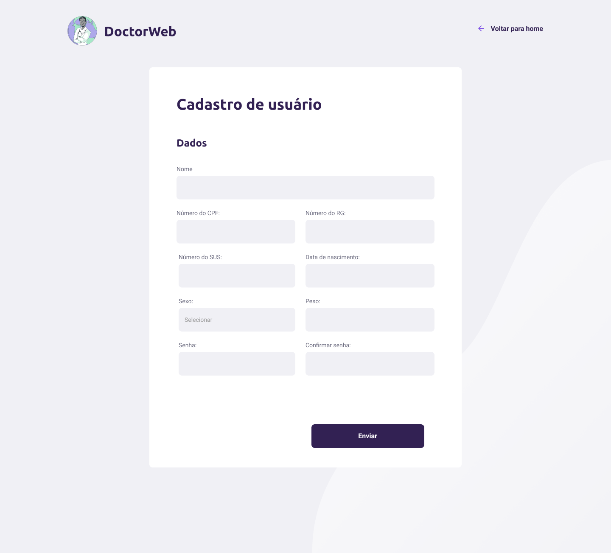
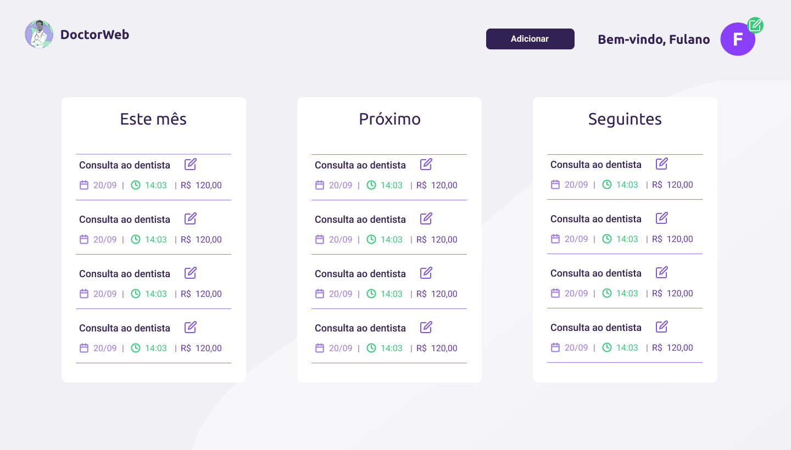
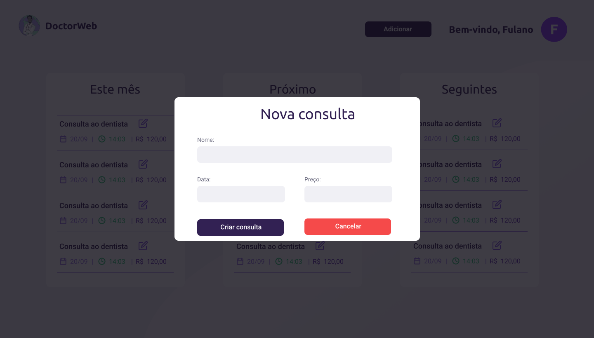
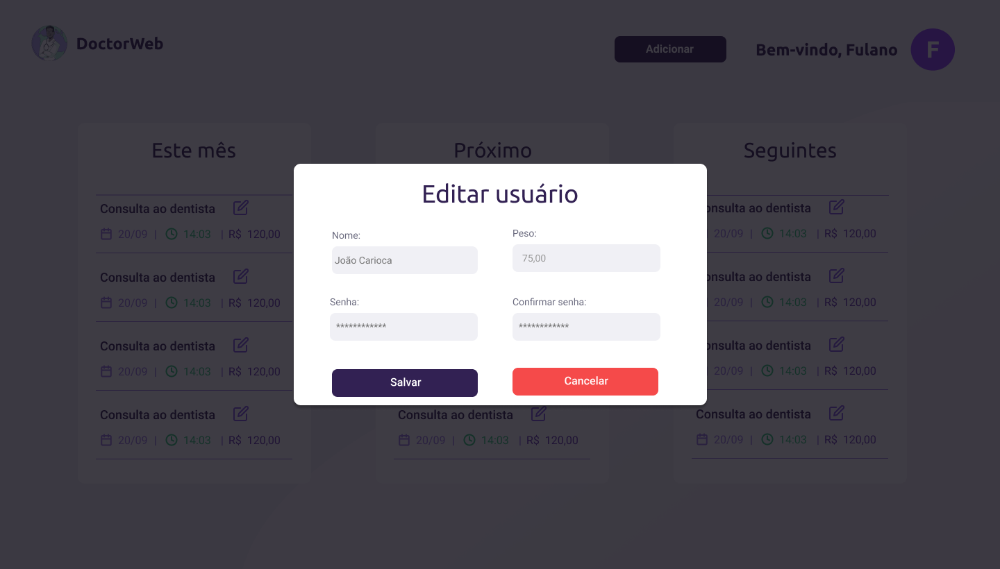

<h1 align="center">
    
</h1>

<h3 align="center">
  Otimiza seu tempo e cuida da sua saúde
</h3>

  

  

  <a href="#calendar-sobre">Sobre</a>&nbsp;&nbsp;&nbsp;|&nbsp;&nbsp;&nbsp; 
  <a href="#memo-licença">Licença</a>&nbsp;&nbsp;&nbsp;|&nbsp;&nbsp;&nbsp; 
  <a href="https://www.figma.com/file/RbmdScgh54OmfgdHDJDvmw/DoctorWeb-Figma?node-id=0%3A1">Figma</a>

## :calendar: Sobre

Esse projeto foi desenvolvido pelos alunos do 2 AII do curso técnico em Informática para a Internet do [Instituto Federal de Educação, Ciência e Tecnologia  Baiano](https://ifbaiano.edu.br)

## :computer: Como executar o projeto
Para conseguir executar o nosso código, é necessário que você tenha o Node.JS instalado em seu computador.
Vá na pasta backend e digite npm install;
Vá na pasta frontend e digite npm install;

Depois de concluído, vá na pasta backend e frontend e digite npm start em cada uma delas para iniciar os servidores;

## :memo: Licença

Esse projeto está sob a licença MIT. Veja o arquivo [LICENSE](/LICENSE) para mais detalhes.

Please, if you are going to create another project with the same images and artwork, give credit to the authors:  
<a href="https://storyset.com/business">SVG illustrations by Storyset</a> 
<a href="https://www.blobmaker.app/">Blobs SVG made by Blobmaker</a>

## 🖼️ Fotos do projeto
<h1 align="center">
    
</h1>
<h1 align="center">
    
</h1>
<h1 align="center">
    
</h1>
<h1 align="center">
    
</h1>
<h1 align="center">
    
</h1>
<h1 align="center">
    
</h1>

---

Feito com :heart: por Cauane, Edmarcos, Emanuel, Giulian e Laura. 
